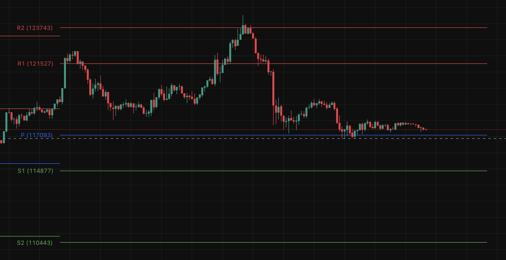

# Pine Script Free Technical Indicators Combination

## About This Scripts

This scripts contains a collection of custom Pine Script indicators designed to provide multiple technical analysis tools in a single script. It's perfect for traders who want access to various technical indicators without needing a paid TradingView subscription.

### Why This Exists

Many traders can't afford premium TradingView plans that allow multiple indicators. This script combines several essential indicators into one, giving you more analytical power without the cost.

### Credits

Special thanks to [LUX Algo](https://www.luxalgo.com/) for their innovative technical analysis concepts which include some of the indicators in this collection.

## What Incudes

- Order Block Detector (LuxAlgo)
- Money Flow Profile (LuxAlgo)
- Smart Money Concepts (LuxAlgo)
- EMA Cross
- Pivot Points

## How to Use

1. Copy the script from `combination.pine`
2. Open TradingView's Pine Editor
3. Paste the code and click "Add to Chart"
4. Customize the settings in the indicator's settings panel

## Additional Features

If the indicators are way too crowded, you can always modify visibility of each indicator by checking the box in the indicator's settings panel.

**Note:** All script used here is free version and provided in TradingView technical indicators.

**Warning:** This script is provided as-is for educational purposes. Always do your own research and consider paper trading before using any strategy with real funds.

## Previews

### EMA Cross

### Order Blocks

### Money Flow Profile

### Smart Money Concepts

### Pivot Points

